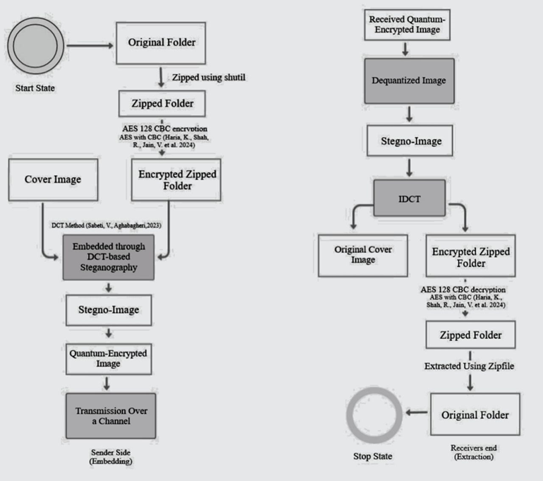

# Steg-Pro Backend

This is the Django backend for the Steg-Pro project. It provides API endpoints for embedding and extracting files using steganography techniques.

## Workflow


## Project Structure

- **steg_backend/**: Main Django project settings and configuration.
- **apps/**: Contains the Django applications:
  - **encryption/**: Handles file embedding via steganography.
  - **decryption/**: Handles file extraction from steganographic images.
  - **common/**: Shared utilities and middleware.
- **files/**: Directory for storing uploaded files, modified images, and output files.
- **manage.py**: Django's command-line utility for administrative tasks.

## API Endpoints

- **POST /embed/**: Embeds files into a cover image using steganography. Accepts a cover image and files to embed.
- **POST /decrypt/**: Extracts embedded files from a steganographic image. Requires the cover image and encryption keys.
- **GET /download/img/**: Downloads the steganographic output image.
- **GET /download/zip/**: Downloads the extracted ZIP file.

## Setup Instructions

1. **Clone the repository**:
   ```bash
   git clone <repository-url>
   cd backend
   ```

2. **Create a virtual environment**:
   ```bash
   python -m venv venv
   source venv/bin/activate  # On Windows, use `venv\Scripts\activate`
   ```

3. **Install dependencies**:
   ```bash
   pip install -r requirements.txt
   ```

4. **Run migrations**:
   ```bash
   python manage.py migrate
   ```

5. **Start the development server**:
   ```bash
   python manage.py runserver
   ```

## Dependencies

- Django 5.2
- django-cors-headers
- cryptography
- numpy
- Pillow
- qiskit
- scipy
- and others (see requirements.txt)

## Configuration

- CORS is configured to allow all origins in development. For production, update `CORS_ALLOWED_ORIGINS` in settings.py.
- CSRF trusted origins are set to localhost:5173. Update `CSRF_TRUSTED_ORIGINS` for production.

## Notes

- This README focuses on the Django backend only. For CLI functionality, refer to the CLI documentation. 